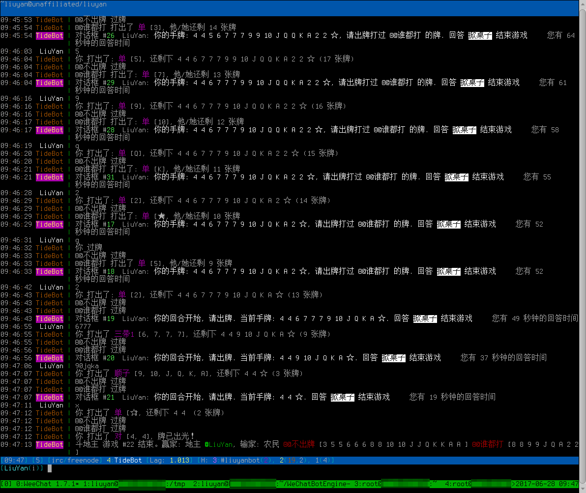
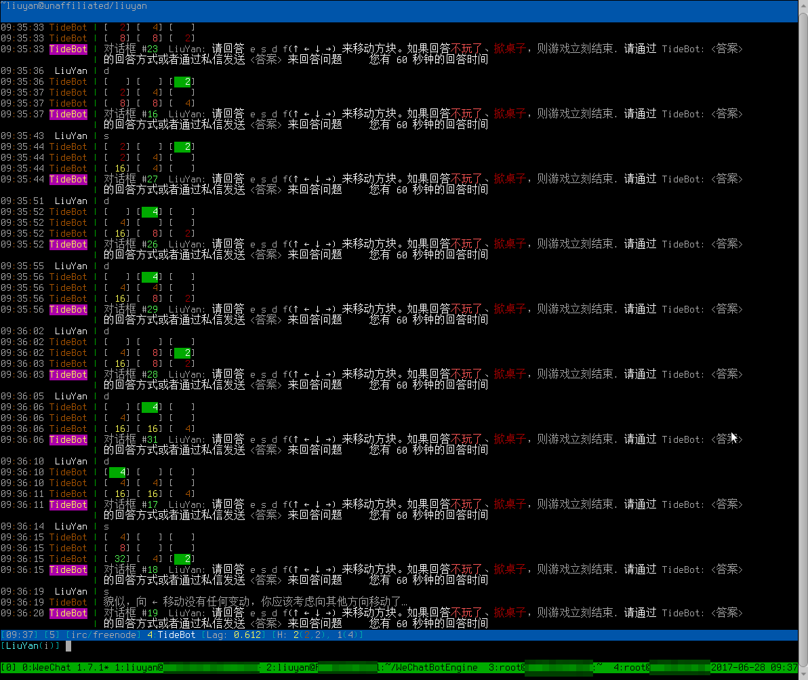

# TideBot #

## 特色 ##

* bot 命令不区分大小写，让机器服务于人类，而不是不让人类适应机器死板的逻辑。
* 尽可能多的支持中文，嗯，命令名、命令选项、`ht` 命令的模板名、`/me` 命令的动作命令名 都允许使用汉字（虽然并未完全实现）
* 支持命令别名，尽量简化用户输入。
    - 比如，game 命令下有很多游戏，则可以直接用游戏名代替 game 命令。如： 斗地主、2048
    - 再比如，ht 命令有诸多用户添加的自定义模板，则可以直接用用模板名直接执行该 ht 模板，如： `ht.run 糗事百科` 直接用 `糗事百科` 执行
    - 再比如，/me 命令也有诸多用户添加的自定义动作，则可以直接用 `.`动作命令 的形式直接执行，如： `/me happy` 直接用 `.happy` 执行

# 对话框 | Dialog #
对话框，原本只是实验阶段的一个产物，目的是实现在 IRC 内实现问答的功能：问用户问题、收集答案。

在功能实现后，其他一些命令就依赖此功能进行交互式处理，如：

* 斗地主游戏抢地主时依次询问用户是否抢地主、`sm` 命令启用/禁用所有的定义时，询问用户 -- 是否类问题
* 斗地主游戏询问是否出牌打过上家 -- 开放型问题(填空题)
* `/vote` 管理命令询问全频道的人是否投票 -- 不限定人数的对话框

# 游戏功能 | Games #

命令用法: `game <游戏名>`

## 斗地主 | DouDiZhu ##

`game 斗地主 /p 玩家2  玩家3`

* 3 人玩，1 副牌
* 抢地主： 按照腾讯游戏的斗地主游戏来抢地主： 1分 2分 3分，选 3 分立刻成为地主，否则继续问其他人
* 大王★、小王☆可用 dw、xw 来代替，用 d、x 代替也可以，不区分大小写； 10 可用 0 或 1 代替
* 过牌： 在批斗阶段，可用下面的任意一个来过牌: pass、 p、 n、 过、 g，在自己的回合阶段不能过牌

## 2048 ##

## 21 点 | BlackJack ##

* 与传统 21 点游戏不同，此游戏没有庄家一说
* 每个人都是平等的：按顺序询问要不要牌，要牌的发一张牌，如果爆牌则“死亡”，爆牌后的玩家不再询问是否要牌。最后，按分数排出胜负：最接近 21 点的胜利 > 2 > 爆牌

## 猜数字 | GuessDigits ##

# 执行外部系统命令 | Cmd #

执行外部命令，并返回 stdout 和/或 stderr 的内容。

注意，这不是 shell，所以类似的功能不支持。目前只实现了管道的功能： command1 | command2

# 多功能 Ht/Json 命令 | Ht/Json #

这是一个多功能 Ht/Json 命令，用来通过 http 协议读取 html 或 json/javascript 数据，并返回相关数据

* ht 命令
* json 命令使用 subselector 指定 javascript 代码

# GitHub 日志 | GitHub commit logs #

# StackExchange 问答站点查询 | StackExchange #

# 查询 IP 地址所在地理位置 - 纯真数据库 | ChunZhen IP-Location #

`ipl <IPv4地址>...`

* 数据库采用的是纯真 IP 数据库 http://www.cz88.net  直接下载 http://update.cz88.net/soft/setup.zip
* IP 地址只能是 IPv4 地址，IPv6 地址将被拒绝查询 (因为目前纯真 IP 数据库只有 IPv4)
* IP 地址可以有多个

# 查询 IP 地址所在地理位置 - MaxMind 数据库 | Maxmind/GeoIP IP-Location #

`geoip[.语言] <IP地址>...`

* 数据库采用的是 MaxMind 的 GeoLiteCity 数据库 http://dev.maxmind.com/geoip/geoip2/geolite2  直接下载 http://geolite.maxmind.com/download/geoip/database/GeoLite2-City.mmdb.gz
* IPv4、IPv6 地址都可以查询
* IP 地址可以有多个
* 因为 GeoLite2 数据库是多语言的，所以可用 `.语言` 来设置查询返回的结果的语言，默认为 `zh_CN` (简体中文)，具体语言请参考 http://dev.maxmind.com/geoip/geoip2/web-services/#Languages

# 查询 MAC 地址所属制造商 | MAC Manufactory #

`macm <MAC地址>...`

* MAC 地址可按几种格式
	- AA:BB:CC
	- AA-BB-CC
	- AA:BB:CC:DD:EE:FF
	- AA-BB-CC-DD-EE-FF
* MAC 地址不区分大小写
